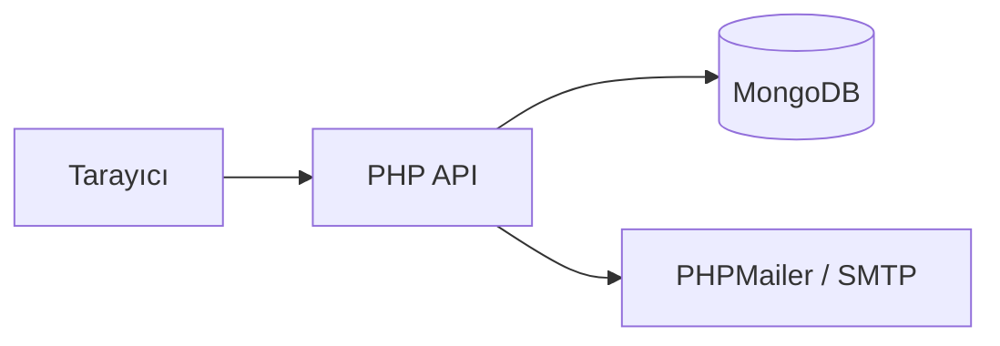

# 📚 Sosyal Kütüphane

Film ve Kitap Sosyal Ağı Uygulaması


## Mimari



## 🐳 Hızlı Başlangıç (Docker)

```bash
docker compose up
```

`http://localhost:8000/index.html` adresinde açılır, veritabanı ve demo hesaplar otomatik oluşturulur (aşağıdaki demo hesaplarla giriş yapabilirsiniz).

## 🚀 Manuel Kurulum

### Adım 0: Bağımlılıklar, veritabanı ve ortam değişkenleri

MongoDB'nin yerelde çalıştığından emin ol (varsayılan port 27017), sonra PHP bağımlılıklarını kur:

```bash
composer install
```

`.env.example` dosyasını `.env` olarak kopyala ve gerekirse değerleri düzenle (varsayılanlar yerel MongoDB için zaten çalışır):

```bash
copy .env.example .env
```

E-posta ile şifre sıfırlama özelliğini kullanacaksanız `.env`'de `SMTP_USERNAME`/`SMTP_PASSWORD` alanlarını doldurun (opsiyonel — boş bırakılırsa sıfırlama linki e-posta yerine sunucu loguna yazılır).

`api/setup-db.php` dosyasını bir kez tarayıcıda açarak MongoDB indekslerini ve demo hesapları oluşturun.

### Adım 1: Server Başlat
`START.bat` dosyasına çift tıkla (Windows) veya `START.sh` (Mac/Linux)

### Adım 2: Tarayıcıda Aç
```
http://localhost:8000/index.html
```

### Adım 3: Giriş Yap
Örnek hesaplar (setup-db.php ile oluşturulur):
- **admin** / admin@test.com
- **test** / test@test.com
- **ahmet** / ahmet@test.com
- **ayse** / ayse@test.com

(Şifre: 123456)

Veya yeni hesap oluştur.

## ✨ Özellikler
- 🔍 Film ve Kitap Arama
- ⭐ İzlediklerim / Okuduklarım
- 💬 Yorum Yapma
- 👥 Takip Sistemi
- 📱 Sosyal Feed
- 🔔 Bildirimler, popüler içerikler, özel listeler

## 📂 Dosya Yapısı
```
sosyal-kutuphane/
├── START.bat              # Server Başlatıcı (Windows)
├── START.sh               # Server Başlatıcı (Mac/Linux)
├── index.html             # Giriş Sayfası
├── search.html             # Arama & Keşfet
├── profile.html            # Profil
├── detail.html             # İçerik Detayı
├── api/                    # Backend API'leri (PHP)
├── js/                     # JavaScript Dosyaları
└── css/                    # Stil Dosyaları
```

## Teknoloji

PHP (mysqli) + vanilla HTML/CSS/JS, PHPMailer (şifre sıfırlama e-postaları için).

## ⚠️ Sorun Giderme

**"Sunucuya bağlanılamıyor"**
→ START.bat'i çalıştırdığından emin ol

**"Veritabanı hatası"**
→ MySQL servisinin çalıştığından ve `DB_PASSWORD` ortam değişkeninin doğru ayarlandığından emin ol

**"Giriş yapılamıyor"**
→ Tarayıcıyı yenile (F5)

## 🎯 İlk Adım
1. Ortam değişkenlerini ayarla, `api/setup-db.php`'yi bir kez çalıştır
2. START.bat çalıştır
3. http://localhost:8000/index.html aç
4. Hesap oluştur veya demo hesapla giriş yap
5. Film/Kitap ara ve keşfet!
