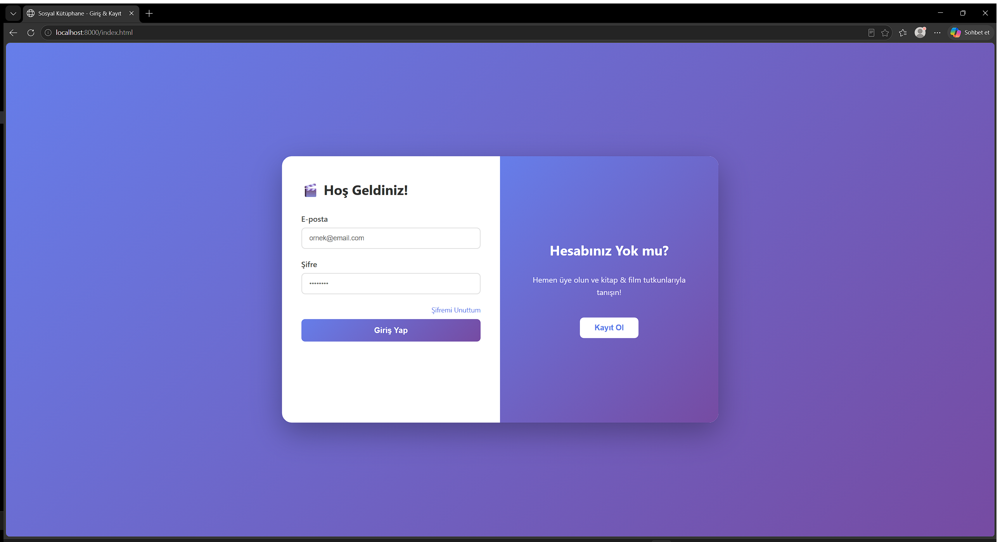
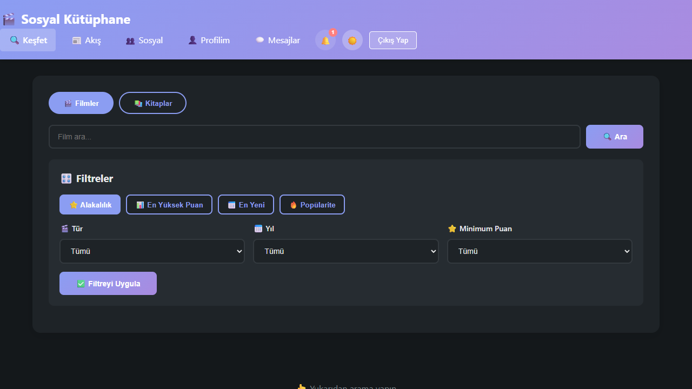
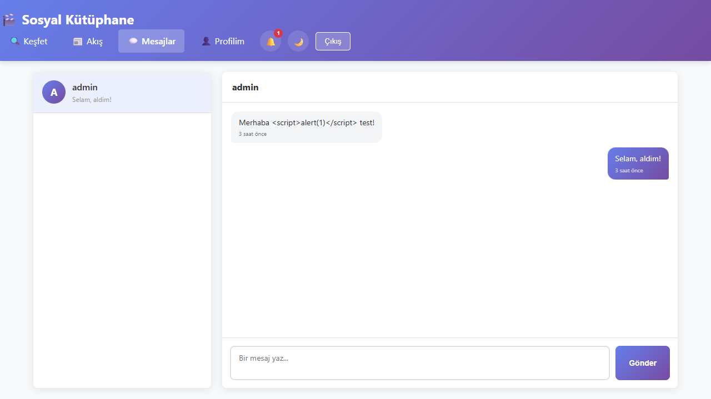
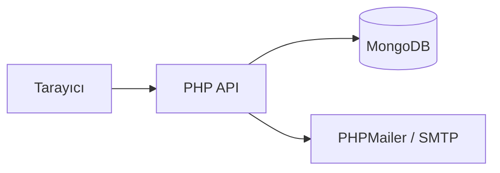

# 📚 Sosyal Kütüphane


Film, Dizi ve Kitap Sosyal Ağı Uygulaması



Karanlık mod + tür filtreleme:


Doğrudan mesajlaşma:


## Mimari



## 🐳 Hızlı Başlangıç (Docker)

```bash
docker compose up
```

`http://localhost:8000/index.html` adresinde açılır, veritabanı ve demo hesaplar otomatik oluşturulur (aşağıdaki demo hesaplarla giriş yapabilirsiniz).

## 🚀 Manuel Kurulum

### Adım 0: Bağımlılıklar, veritabanı ve ortam değişkenleri

MongoDB'nin yerelde çalıştığından emin ol (varsayılan port 27017), sonra PHP bağımlılıklarını kur:

```bash
composer install
```

`.env.example` dosyasını `.env` olarak kopyala ve gerekirse değerleri düzenle (varsayılanlar yerel MongoDB için zaten çalışır):

```bash
copy .env.example .env
```

E-posta ile şifre sıfırlama özelliğini kullanacaksanız `.env`'de `SMTP_USERNAME`/`SMTP_PASSWORD` alanlarını doldurun (opsiyonel — boş bırakılırsa sıfırlama linki e-posta yerine sunucu loguna yazılır).

`api/setup-db.php` dosyasını bir kez tarayıcıda açarak MongoDB indekslerini ve demo hesapları oluşturun.

### Adım 1: Server Başlat
`START.bat` dosyasına çift tıkla (Windows) veya `START.sh` (Mac/Linux)

### Adım 2: Tarayıcıda Aç
```
http://localhost:8000/index.html
```

### Adım 3: Giriş Yap
Örnek hesaplar (setup-db.php ile oluşturulur):
- **admin** / admin@test.com
- **test** / test@test.com
- **ahmet** / ahmet@test.com
- **ayse** / ayse@test.com

(Şifre: 123456)

Veya yeni hesap oluştur.

## ✨ Özellikler
- 🔍 Film, Dizi ve Kitap Arama, tür/kategori filtreleme
- ⭐ İzlediklerim (Film/Dizi) / Okuduklarım, puanlama
- 💬 Yorum Yapma (yanıt, beğeni)
- 👥 Takip Sistemi
- 📱 Sosyal Feed
- 🔔 Gerçek zamanlıya yakın bildirimler (takip, mesaj — otomatik yenilenen zil)
- 💬 Kullanıcılar arası doğrudan mesajlaşma
- 📁 Özel listeler, popüler içerikler
- ⚙️ Hesap ayarları: şifre değiştirme, e-posta değiştirme (çift adımlı e-posta doğrulamalı), dosya ile avatar yükleme
- 🌙 Karanlık mod
- 🔐 Hash'lenmiş şifreler, CSRF koruması, giriş denemesi sınırlama

## 📂 Dosya Yapısı
```
sosyal-kutuphane/
├── START.bat              # Server Başlatıcı (Windows)
├── START.sh               # Server Başlatıcı (Mac/Linux)
├── index.html             # Giriş Sayfası
├── search.html             # Arama & Keşfet
├── profile.html            # Profil, hesap ayarları
├── detail.php              # İçerik Detayı (film/dizi/kitap, Open Graph önizlemesi)
├── messages.html            # Mesajlaşma
├── api/                    # Backend API'leri (PHP)
├── js/                     # JavaScript Dosyaları
├── css/                    # Stil Dosyaları (tasarım token'ları, karanlık mod)
└── tests/                  # PHPUnit + Node testleri
```

## Teknoloji

PHP + MongoDB (`mongodb/mongodb` composer paketi) + vanilla HTML/CSS/JS. PHPMailer (şifre sıfırlama ve e-posta doğrulama kodları için). MongoDB yerelde ya da [Atlas](https://www.mongodb.com/atlas) gibi bulut bir cluster'da çalışabilir — `.env`'deki `MONGO_URI`'yi değiştirmen yeterli.

## 🧪 Testler

```bash
composer install    # phpunit/phpunit dahil (dev bağımlılık)
php -S localhost:8000 &
vendor/bin/phpunit --testdox   # API entegrasyon testleri (çalışan sunucu + MongoDB gerektirir)
node --test tests/escape-html.test.mjs   # XSS-kaçış birim testleri
```

`master`/`main`'e her push'ta ve her PR'da GitHub Actions aynı testleri kendi MongoDB servis konteynerine karşı otomatik çalıştırır (bkz. `.github/workflows/ci.yml`).

## ⚠️ Sorun Giderme

**"Sunucuya bağlanılamıyor"**
→ START.bat'i çalıştırdığından emin ol

**"Veritabanı bağlantı hatası"**
→ MongoDB servisinin çalıştığından ve `.env`'deki `MONGO_URI`'nin doğru olduğundan emin ol. Atlas kullanıyorsan Atlas konsolunda **Network Access**'e mevcut IP'nin (veya geliştirme için `0.0.0.0/0`) eklendiğini kontrol et — eklenmemişse bağlantı TLS aşamasında sessizce başarısız olur.

**"Giriş yapılamıyor"**
→ Tarayıcıyı yenile (F5)

## 🎯 İlk Adım
1. Ortam değişkenlerini ayarla, `api/setup-db.php`'yi bir kez çalıştır
2. START.bat çalıştır
3. http://localhost:8000/index.html aç
4. Hesap oluştur veya demo hesapla giriş yap
5. Film/Dizi/Kitap ara ve keşfet!
