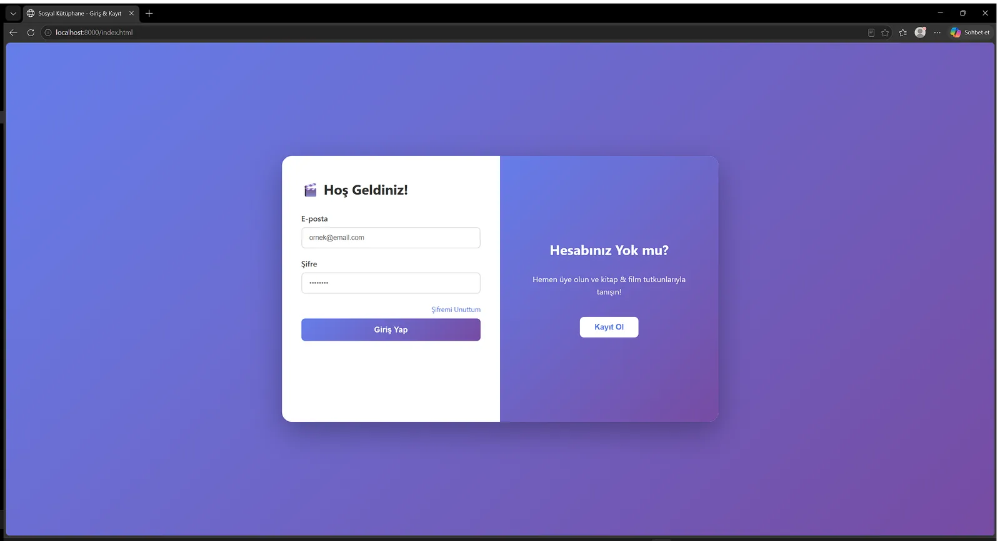
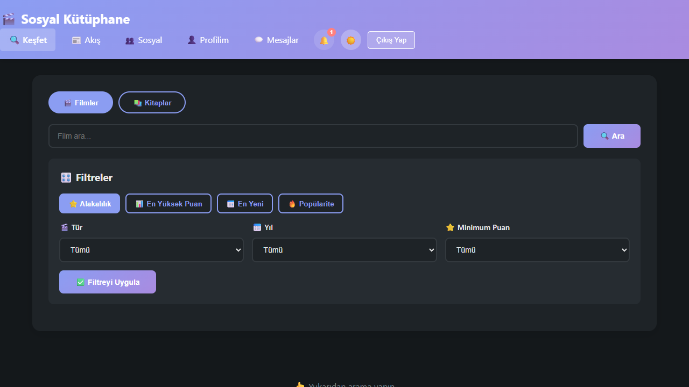
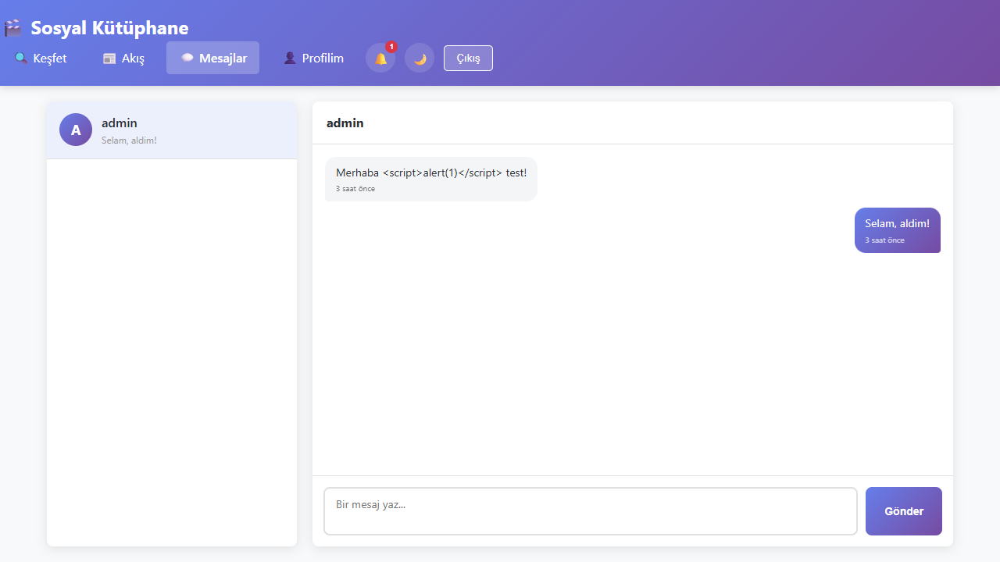

# Sosyal Kütüphane

Film, dizi ve kitaplar için yapılmış bir sosyal ağ sitesi. Kullanıcılar içerik arayıp izlediklerine ve okuduklarına puan verebiliyor, yorum yazabiliyor, birbirini takip edip mesajlaşabiliyor. PHP ve MongoDB ile yazıldı.




Karanlık mod ve tür filtreleme:



Mesajlaşma:



## Neler var

- Film, dizi ve kitap arama, tür filtreleme
- İzlediklerim / okuduklarım listesi ve puanlama
- Yorum yapma (yanıt ve beğeni dahil)
- Kullanıcı takip etme, takip ettiklerin için akış
- Bildirimler (takip, mesaj)
- Kullanıcılar arası mesajlaşma
- Özel listeler ve popüler içerikler
- Hesap ayarları: şifre değiştirme, e-posta değiştirme (doğrulama koduyla), avatar yükleme
- Karanlık mod
- Şifreler hash'leniyor, CSRF koruması ve giriş denemesi sınırı var

## Kullanılanlar

PHP, MongoDB (`mongodb/mongodb` composer paketi), HTML/CSS/JS, PHPMailer (şifre sıfırlama ve doğrulama kodu için). MongoDB yerelde ya da Atlas'ta olabilir, `.env` içindeki `MONGO_URI` değiştirilirse yetiyor.

Film/dizi verisi TMDB'den, kitap verisi Google Books'tan geliyor. Tarayıcı bu servislere doğrudan gitmiyor, istekler `api/tmdb-proxy.php` ve `api/books-proxy.php` üzerinden geçip `api_cache` koleksiyonunda saklanıyor (popüler listeler 6 saat, arama 1 saat, detay 24 saat). Böylece API anahtarları tarayıcıda görünmüyor ve aynı veri tekrar tekrar indirilmiyor.

## Çalıştırma

Docker ile:

```
docker compose up
```

`http://localhost:8000/index.html` adresinde açılır, veritabanı ve demo hesaplar kendiliğinden oluşur.

Docker olmadan:

1. MongoDB'nin çalıştığından emin olun (varsayılan port 27017) ve `composer install` çalıştırın
2. `.env.example` dosyasını `.env` olarak kopyalayın (`copy .env.example .env`). Yerel MongoDB için varsayılanlar yeterli
3. `.env` içine `TMDB_API_KEY` yazın ([themoviedb.org](https://www.themoviedb.org/settings/api) üzerinden ücretsiz alınıyor), olmazsa film ve dizi araması çalışmaz. `GOOGLE_BOOKS_API_KEY` isteğe bağlı, boşsa kitap aramasında ara sıra 429 hatası gelebilir
4. Şifre sıfırlama e-postası için `SMTP_USERNAME` ve `SMTP_PASSWORD` doldurulabilir. Boş bırakılırsa sıfırlama linki sunucu loguna yazılıyor
5. Tarayıcıda `api/setup-db.php` dosyasını bir kez açın, indeksleri ve demo hesapları oluşturuyor
6. `START.bat` (Windows) ya da `START.sh` (Mac/Linux) ile sunucuyu başlatıp `http://localhost:8000/index.html` adresine girin

Demo hesaplar (şifre hepsinde `123456`): `admin@test.com`, `test@test.com`, `ahmet@test.com`, `ayse@test.com`

## Render'da yayınlama

Repodaki `Dockerfile` Render'da doğrudan çalışıyor:

1. [render.com](https://render.com)'da GitHub ile girip New > Web Service ile bu repoyu seçin, Runtime olarak Docker seçilecek
2. Environment bölümüne `.env` içindeki değerleri ekleyin: `MONGO_URI`, `MONGO_DB`, `TMDB_API_KEY`, `GOOGLE_BOOKS_API_KEY` (isteğe bağlı)
3. `SITE_URL` olarak Render'ın verdiği `https://<servis-adi>.onrender.com` adresini girin ve yeniden yayınlayın, CORS bu değere bakıyor
4. İlk açılışta `api/setup-db.php` indeksleri ve demo hesapları oluşturuyor

Ücretsiz planda site birkaç dakika kullanılmazsa uyuyor, ilk istek yavaş gelebilir. Yüklenen avatarlar (`uploads/`) kalıcı diskte durmadığı için her yeni yayında sıfırlanıyor.

## Testler

Testler gerçek HTTP isteğiyle çalışan bir sunucuya karşı koşuyor. Bu sunucu gerçek veritabanını kullanırsa testler oraya sahte kullanıcı ve içerik yazar (bir kere böyle oldu, temizlendi, bkz. `tests/bootstrap.php`). O yüzden test için ayrı port ve ayrı veritabanı adıyla ikinci bir sunucu açılıyor:

```
composer install
MONGO_DB=social_library_test php -S localhost:8001 &
TEST_BASE_URL=http://localhost:8001 vendor/bin/phpunit --testdox
node --test tests/escape-html.test.mjs
```

PowerShell'de `MONGO_DB` ve `TEST_BASE_URL` değişkenleri `$env:MONGO_DB='social_library_test'` biçiminde ayrı satırlarda verilir. Her push'ta GitHub Actions aynı testleri kendi MongoDB konteynerine karşı çalıştırıyor (`.github/workflows/ci.yml`).

## Klasörler

```
index.html     giriş sayfası
search.html    arama ve keşfet
profile.html   profil ve hesap ayarları
messages.html  mesajlaşma
detail.php     içerik detayı
api/           PHP API'leri
js/ css/       arayüz dosyaları
tests/         PHPUnit ve Node testleri
START.bat, START.sh   sunucuyu başlatır
```

## Sorun çıkarsa

- "Sunucuya bağlanılamıyor": `START.bat` çalışıyor mu bakın
- "Veritabanı bağlantı hatası": MongoDB açık mı ve `.env` içindeki `MONGO_URI` doğru mu. Atlas kullanıyorsanız Atlas'ta Network Access listesine kendi IP'nizi (geliştirme için `0.0.0.0/0`) ekleyin, eklenmezse bağlantı sessizce başarısız oluyor
- "Giriş yapılamıyor": sayfayı yenileyin (F5)
